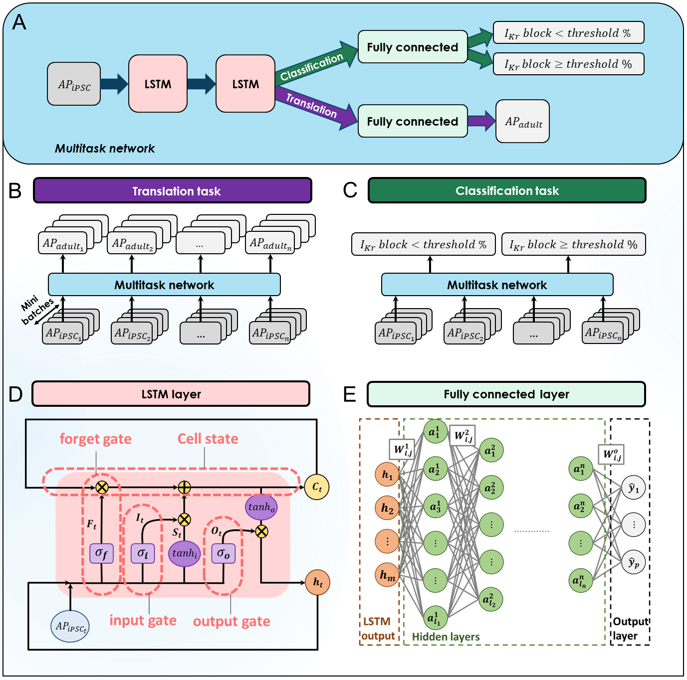

# Multitask_network

We developed a data-driven algorithm intended to address well known shortcomings in the induced pluripotent stem cell-derived cardiomyocyte (iPSC-CMs) platform.  A known concern with iPSC-CMs is that the data collection results in measurements from immature action potentials and it is unclear if these data reliably indicate impact in the adult cardiac environment.  Here, we set out to demonstrate a new deep learning algorithm to classify cells into the drugged and drug free categories and can be used to predict the impact of electrophysiological perturbation across the continuum of aging from the immature iPSC-CM action potential to the adult ventricular myocyte action potential. 

{:height="50%" width="50%"}
